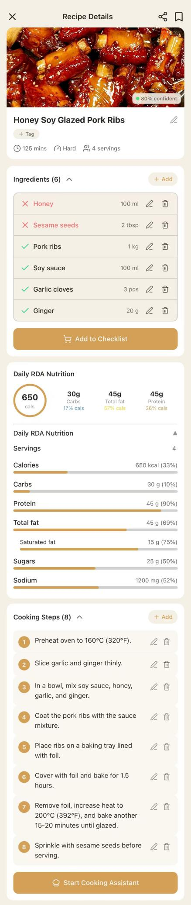

# PantryTales Showcase

> 中文说明：本仓库为 PantryTales 项目的公开展示版本，仅用于项目展示、技术交流与个人作品集展示，不包含完整项目源码。

PantryTales is an AI-powered smart kitchen mobile application designed to support the complete cooking workflow, from ingredient recognition to recipe generation, cooking assistance, and community interaction.

The system aims to help users better manage kitchen inventory, reduce food waste, and discover personalized recipes based on their available ingredients and dietary preferences.

This repository is a public showcase version of the project for portfolio and demonstration purposes only. The complete production source code is not included.

---

# Project Overview

PantryTales addresses several common challenges in household cooking:

* Users often do not know what meals they can prepare using existing ingredients.
* Ingredients are frequently forgotten, wasted, or purchased repeatedly.
* Traditional recipe applications rarely consider dietary preferences and allergy restrictions.
* Cooking applications often lack an end-to-end workflow from ingredient recognition to meal preparation.
* Family members need a shared inventory and collaborative cooking experience.

By combining AI image recognition, structured inventory management, personalized recipe generation, and community interaction, PantryTales provides an integrated smart kitchen experience.

---

# Repository Contents

This public showcase repository only contains materials suitable for portfolio presentation.

Included:

* `README.md`
* `architecture/`
* `screenshots/`
* `demo/`
* `code-samples/`

This repository is not intended for local deployment or secondary development.

---

# My Contributions

As a Software Development Intern, I was primarily responsible for:

* Smart Recipe feature development
* Ingredient Scan feature development
* Recipe Scan feature development
* Community module development
* Frontend-backend integration and feature testing

---

# Core Modules

## 1. Community Module

Responsible for the design and implementation of the Community module, enabling users to share and interact with recipes.

Features include:

* Recipe publishing and content display
* User interactions, including likes, comments, and saves
* Community feed state synchronization
* User interaction tracking and engagement management

Representative code:

```text
code-samples/Community/
```

This module demonstrates API design, business logic implementation, permission validation, interaction state management, and frontend-backend integration.

---

## 2. Smart Recipe Module

Responsible for the development of the Smart Recipe feature, generating personalized recipes based on users' available ingredients, dietary preferences, and serving size requirements.

Main responsibilities include:

* Generating personalized recipes based on current inventory ingredients
* Supporting dietary preferences and allergy restrictions
* Adjusting recipe recommendations according to the number of servings
* Implementing recipe generation workflows and result presentation
* Completing frontend-backend integration and feature testing

Representative code:

```text
code-samples/Recommendation/
```

This module demonstrates how inventory data, user preferences, and serving requirements are integrated to provide personalized cooking suggestions.

---

## 3. AI / Vision Module

Responsible for AI-powered image recognition capabilities based on GPT-4o Vision.

Features include:

* Ingredient Scan
* Recipe Scan
* Ingredient image recognition and structured parsing
* Recipe image recognition and structured parsing
* AI response processing and data persistence
* Prompt design and exception handling

Representative code:

```text
code-samples/AI/
```

This module demonstrates AI service integration, image processing workflows, prompt engineering, structured JSON output, and error handling.

---

# Feature Preview

## Ingredient Recognition


## Recipe Scan



## Smart Recipes


## Community Feed


## Recipe Detail


---

# Architecture Preview

## System Architecture


## AI Recommendation Workflow


## Ingredient Scan Flow


## Vector Search Workflow


---

# Technology Stack

## Mobile Application

* React Native
* Expo
* TypeScript

## Backend

* ASP.NET Core
* Entity Framework Core
* RESTful API

## Database

* PostgreSQL
* pgvector

## AI Capabilities

* OpenAI API
* GPT-4o Vision
* OpenAI Embedding API
* Image Recognition
* Structured Content Generation

## Cloud & Engineering

* Docker
* GitHub Actions
* AWS App Runner

---

# Project Structure

```text
README.md
architecture/
screenshots/
demo/
code-samples/
```

---

# Code Samples

The code samples contained in this repository are representative excerpts only and are not intended to be executed independently.

They are provided to demonstrate:

* Backend API design
* Business logic organization
* Permission validation
* AI service encapsulation
* Recommendation workflow implementation
* Frontend-backend integration

---

# Security & Public Scope

For security, privacy, and intellectual property reasons, the public version excludes:

* Complete frontend source code
* Complete backend source code
* API keys
* Environment variables
* Database configurations
* Deployment scripts
* Docker configurations
* Build artifacts

No production credentials or sensitive information are included in this repository.

---

# Demo

Project demonstrations are available in:

```text
demo/
```

---

# Disclaimer

This repository is intended solely for educational, portfolio, and technical communication purposes.

All screenshots, architecture diagrams, and project documentation remain the intellectual property of the author.
