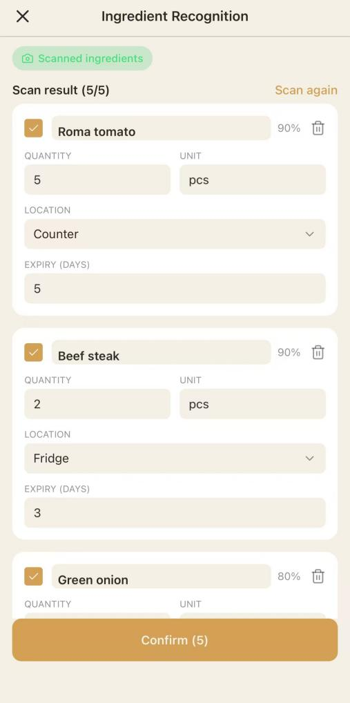
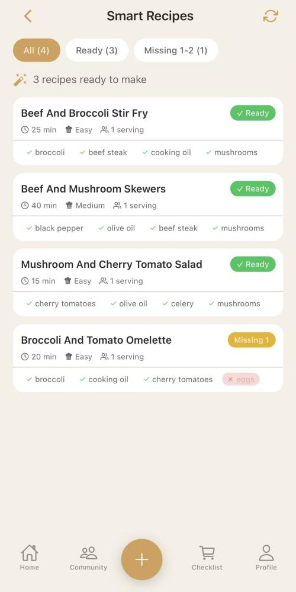
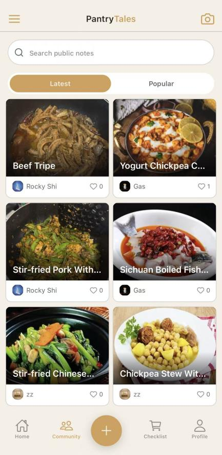
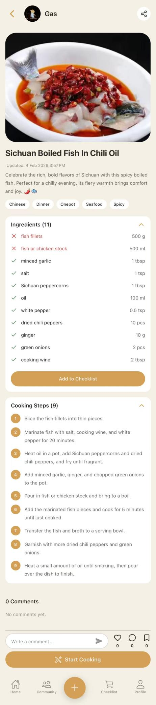
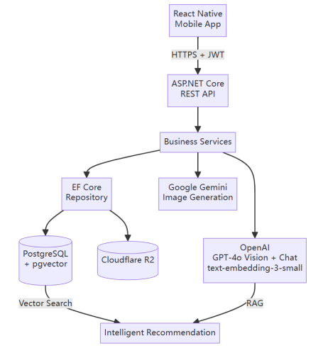
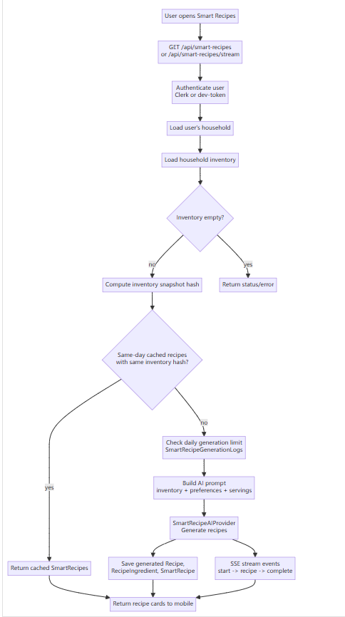
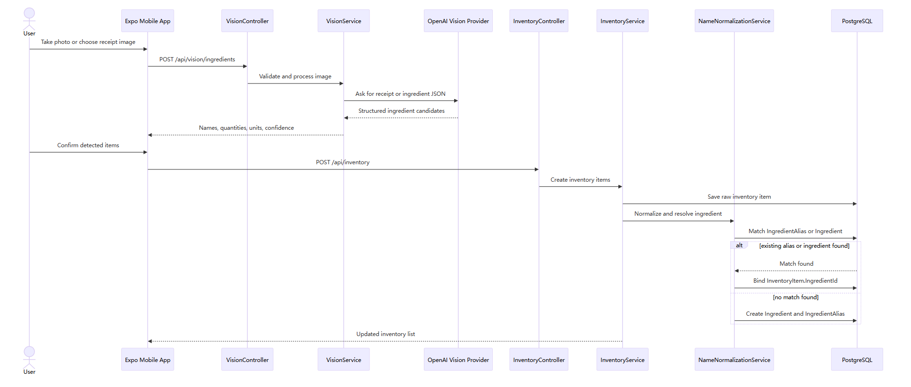
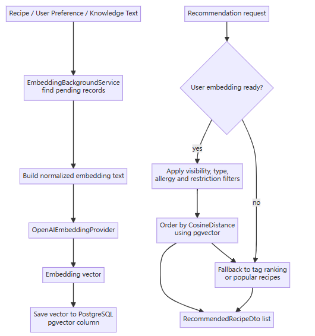

# PantryTales Showcase

PantryTales 是一个 AI 智能厨房应用项目，围绕“从食材到菜谱再到烹饪”的完整家庭厨房场景展开。项目核心能力包括食材识别、库存管理、智能菜谱推荐、社区菜谱互动和烹饪辅助流程。

本仓库是 PantryTales 的公开作品展示版本，仅用于项目展示、能力说明和代码样例展示，不包含完整可运行源码。

---

## 项目定位

PantryTales 旨在解决家庭厨房中常见的几个问题：

- 用户不知道现有食材可以做什么菜
- 食材库存容易遗忘、浪费或重复购买
- 菜谱推荐缺少对个人偏好、过敏和饮食限制的考虑
- 烹饪过程缺少从识别、推荐、执行到记录的连续体验
- 家庭成员之间缺少共享库存和协作管理方式

项目通过 AI 图片识别、结构化食材管理、语义推荐和社区互动，将食材、菜谱和用户行为串联成一个完整的智能厨房工作流。

---

## 本仓库内容

该公开仓库只保留适合作品展示的内容：

- `README.md`：项目总览说明
- `architecture/`：系统架构图、AI 推荐流程图、食材扫描流程图、向量检索流程图等
- `screenshots/`：主要功能页面截图
- `demo/`：项目演示入口
- `code-samples/`：少量精选 C# 后端代码样例

该仓库不用于本地运行、部署或二次开发。

---

## 我的负责模块

### 1. 社区互动模块

负责社区菜谱相关的互动能力，包括：

- 菜谱评论
- 评论点赞
- 菜谱点赞
- 菜谱收藏
- 用户互动事件记录
- 互动计数与状态同步

代表性代码：

```text
code-samples/Community/
```

该部分展示了 API 入口设计、权限校验、事务处理、并发冲突处理和互动数据建模思路。

---

### 2. 菜谱推荐模块

负责智能菜谱推荐相关逻辑，包括：

- 根据用户偏好推荐菜谱
- 根据过敏信息和饮食限制过滤不适合的菜谱
- 基于标签匹配进行排序
- 结合向量相似度进行 fallback 推荐
- 在缺少个性化数据时回退到热门菜谱

代表性代码：

```text
code-samples/Recommendation/
```

该部分展示了如何将用户偏好、业务规则、搜索条件、语义向量和热门数据结合到推荐流程中。

---

### 3. AI / 图片识别模块

负责 AI 图片识别相关能力，包括：

- 食材图片识别
- 小票/收据中的食材提取
- 菜品图片识别
- 根据图片生成菜谱内容
- 多图片生成步骤、标签和食材列表
- AI 返回结果的结构化解析

代表性代码：

```text
code-samples/AI/
```

该部分展示了图片校验、AI Provider 封装、提示词设计、JSON 结构化输出和异常处理方式。

---

## 功能预览

### 食材识别



### 智能菜谱推荐



### 社区菜谱



### 菜谱详情



---

## 架构预览

### 系统架构



### AI 推荐流程



### 食材扫描流程



### 向量检索流程



---

## 技术栈概览

完整项目曾使用以下技术：

### 移动端

- React Native
- Expo
- TypeScript

### 后端

- ASP.NET Core
- Entity Framework Core
- RESTful API

### 数据与推荐

- PostgreSQL
- pgvector
- 向量相似度检索
- 标签与用户偏好匹配

### AI 能力

- OpenAI Vision
- Embeddings
- 图片识别
- 结构化内容生成

### 云端与工程化

- 对象存储
- 容器化部署
- CI/CD

公开版本仅保留展示材料和精选代码样例，不包含部署配置或完整工程配置。

---

## 目录结构

```text
README.md
architecture/
  README.md
  system-architecture-diagram.png
  core-database-er-diagram.png
  ingredient-scan-flow.png
  ai-recommendation-workflow.png
  vector-search-workflow.png
  deployment-architecture.png
screenshots/
  README.md
  *.png
demo/
  README.md
code-samples/
  README.md
  Community/
  Recommendation/
  AI/
```

---

## 代码样例说明

`code-samples/` 中的代码不是完整项目源码，只是为了展示关键功能实现方式而保留的代表性片段。

这些样例可能依赖已移除的接口、实体、DTO、配置或上下文，因此不能直接运行。保留它们的目的是展示：

- 后端 API 设计
- 业务逻辑组织
- 权限与数据校验
- 事务与并发处理
- AI 服务封装
- 推荐逻辑设计

---

## 安全与公开范围

出于安全、隐私和知识产权考虑，公开版本已移除以下内容：

- 完整后端源码
- 完整移动端源码
- 数据库连接配置
- API Key
- 环境变量
- 部署脚本
- Docker 配置
- 构建产物
- 数据库迁移文件
- 完整业务逻辑

本仓库不包含任何可用于连接真实服务、数据库或第三方 API 的密钥和配置。

---

## Demo

项目演示入口位于：

```text
demo/
```

---

## Notice

This repository is intended for project showcase and educational purposes.

Sensitive environment files and generated dependency folders are excluded from the repository.

All rights reserved. The contents of this repository, including documentation, screenshots, design assets, and implementation details, may not be copied, modified, redistributed, or used for commercial purposes without prior written permission from the author.
