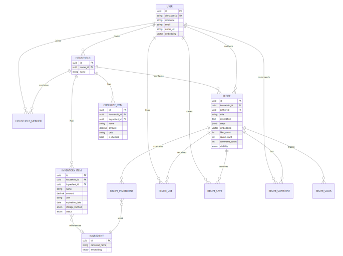
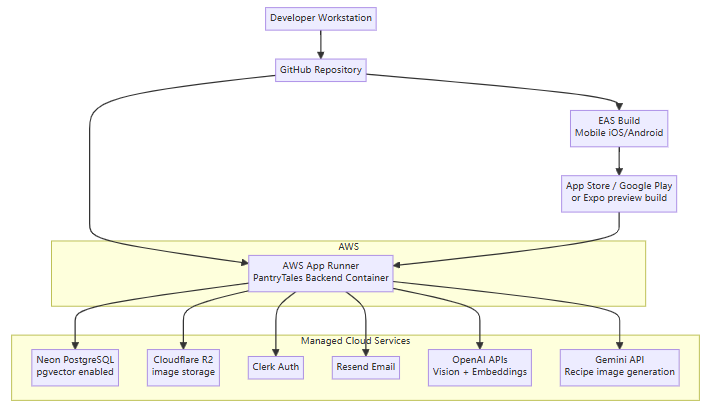

# 架构图说明

本目录用于展示 PantryTales 的核心系统架构和主要业务流程图。这里保留的是作品展示材料，不包含可运行的部署配置或完整系统实现。

---

## 1. 系统架构图

该图展示 PantryTales 的整体技术架构，包括：

- React Native 移动端
- ASP.NET Core 后端服务
- PostgreSQL 与 pgvector
- AI 服务集成
- 对象存储
- 推荐与识别相关流程

---

## 2. 核心数据库 ER 图

该图展示项目核心数据模型的关系，重点覆盖：

- 用户
- 家庭/成员
- 库存食材
- 菜谱
- 点赞、收藏、评论
- 菜谱食材关系

公开版本仅展示主要实体，省略完整数据库结构和迁移文件。

---

## 3. 食材识别流程

该流程展示图片或小票上传后，系统如何完成食材识别和入库：

- 上传图片
- AI 识别食材或小票条目
- 结构化提取结果
- 用户确认
- 食材名称标准化
- 写入库存

---

## 4. AI 推荐流程

该流程展示智能菜谱推荐的主要步骤：

- 分析用户库存与偏好
- 生成或读取向量表示
- 语义检索候选菜谱
- 根据偏好、限制和互动数据排序
- 返回推荐结果

---

## 5. 向量检索流程

该图说明项目如何使用向量表示和相似度搜索辅助推荐：

- 生成菜谱 embedding
- 存储向量
- 执行相似度检索
- 召回候选菜谱
- 结合业务规则排序

---

## 6. 部署架构图

该图仅用于展示完整项目曾采用的云端部署思路。公开仓库不包含任何部署脚本、密钥、环境变量或数据库连接配置。
